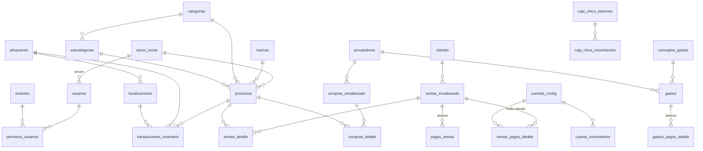

# EasyCount — Esquema de base de datos (Supabase / PostgreSQL)

Documentación de las tablas y vistas del proyecto. Los scripts de migración viven en [scripts/](../scripts/) y se ejecutan en orden en el SQL Editor de Supabase.

## Principio multi-tenant

Casi todas las tablas tienen la columna **`razon_social_id → razon_social.id`**: cada fila pertenece a una empresa. La app estampa este valor en cada insert ([lib/services/tenant-stamp.ts](../lib/services/tenant-stamp.ts)) y filtra todos los queries por él. La mayoría de tablas también guardan una columna `usuario` (text) con el nombre de quien creó el registro, a modo de auditoría ligera.

## Diagrama de relaciones (resumen)

---

## Núcleo: empresa, usuarios y permisos

### `razon_social`
Empresas (tenants) del sistema.

| Columna | Tipo | Notas |
|---|---|---|
| `id` | bigint | PK |
| `nombre_empresa` | text | NOT NULL — razón social legal |
| `nombre_comercial` | text | |
| `documento` | text | NOT NULL — RTN de la empresa |
| `correo`, `telefono`, `direccion` | text | |
| `logo_url` | text | Logo en Supabase Storage (aparece en facturas PDF) |

### `usuarios`
Perfil de aplicación ligado a Supabase Auth (el `id` es el uuid de `auth.users`).

| Columna | Tipo | Notas |
|---|---|---|
| `id` | uuid | PK = id en `auth.users` |
| `nombre` | text | NOT NULL |
| `rol` | text | default `'Usuario'` (ej. `Admin` / `Usuario`) |
| `activo` | boolean | default `true` — desactivar en vez de borrar |
| `razon_social_id` | bigint | FK → `razon_social.id` (empresa del usuario) |
| `created_at` | timestamptz | default `now()` |

### `modulos`
Catálogo de los 23 módulos de la app (espejo de [lib/constants/modulos.ts](../lib/constants/modulos.ts) — el `nombre` debe coincidir).

| Columna | Tipo | Notas |
|---|---|---|
| `id` | bigint | PK |
| `nombre` | text | NOT NULL — clave del permiso |
| `icono` | text | |

### `permisos_usuarios`
Qué módulo puede ver cada usuario (el `RouteGuard` bloquea la ruta si no hay permiso).

| Columna | Tipo | Notas |
|---|---|---|
| `id` | bigint | PK |
| `usuario_id` | uuid | FK → `usuarios.id` |
| `modulo_id` | bigint | FK → `modulos.id` |
| `puede_ver` | boolean | default `false` |

---

## Catálogos

### `productos`

| Columna | Tipo | Notas |
|---|---|---|
| `id` | bigint | PK |
| `nombre` | text | NOT NULL |
| `codigo_barras` | text | |
| `marca_id` | bigint | FK → `marcas.id` |
| `categoria_id` | bigint | FK → `categorias.id` |
| `subcategoria_id` | bigint | FK → `subcategorias.id` |
| `stock_total` | numeric | default 0 — cache del stock global (la verdad está en `transacciones_inventario`) |
| `costo_promedio` | numeric | default 0 — costo promedio ponderado, se recalcula en cada recepción de compra |
| `precio_venta_sugerido` | numeric | default 0 |
| `foto_url` | text | Supabase Storage |
| `razon_social_id` | bigint | FK tenant |
| `usuario`, `updated_at` | text, date | auditoría |

### `marcas`, `categorias`, `subcategorias`
Catálogos simples: `id` (PK), `nombre` (NOT NULL), `razon_social_id` (FK tenant), `usuario`, `created_at`. `subcategorias` además tiene `categoria_id` (FK → `categorias.id`) y `descripcion`.

### `clientes`

| Columna | Tipo | Notas |
|---|---|---|
| `id` | bigint | PK |
| `nombre` | text | NOT NULL |
| `rtn` | text | RTN para factura |
| `telefono`, `direccion` | text | |
| `fecha_nacimiento` | date | usado para alertas de cumpleaños |
| `razon_social_id` | bigint | FK tenant |

### `proveedores`
`id` (PK), `nombre` (NOT NULL), `rtn`, `contacto`, `razon_social_id`, `usuario`.

### `almacenes` y `localizaciones`
- `almacenes`: `id`, `nombre` (NOT NULL), `ubicacion`, `razon_social_id`, `usuario`.
- `localizaciones`: `id`, `nombre` (NOT NULL), `almacen_id` (FK → `almacenes.id`), `razon_social_id`, `usuario`. El stock se lleva a nivel almacén + localización.

---

## Ventas

### `ventas_encabezado`
Encabezado de factura de venta.

| Columna | Tipo | Notas |
|---|---|---|
| `id` | bigint | PK |
| `numero_factura` | text | correlativo generado por la app |
| `cliente_id` | bigint | FK → `clientes.id` |
| `almacen_id` | bigint | FK → `almacenes.id` — almacén del que sale la mercancía |
| `fecha_venta` | timestamptz | default `now()` |
| `tipo_pago` | text | Contado / Parcial / Crédito |
| `aplica_impuesto` | boolean | |
| `porcentaje_impuesto` | numeric | default 15 (ISV Honduras) |
| `descuento` | numeric | % de descuento sobre el subtotal |
| `subtotal` | numeric | default 0 — bruto antes de descuento |
| `impuesto_total` | numeric | default 0 — sobre (subtotal − descuento) |
| `total_venta` | numeric | default 0 — **BRUTO** (subtotal − descuento + ISV): lo que factura/paga el cliente. La comisión bancaria NO lo reduce (es un costo aparte). Coincide con la suma de las líneas de `ventas_detalle`. Ver script 027. |
| `valorpago` | numeric | default 0 — pagado acumulado en **bruto** (`Σ monto_bruto`); `saldo = total_venta − valorpago` |
| `estado_pago` | text | `Pendiente` / `Parcial` / `Pagado` |
| `razon_social_id` | bigint | FK tenant |
| `usuario` | text | vendedor |

### `ventas_detalle`
Líneas de la venta. Congela el costo al momento de vender (para el CMV del estado de resultados).

| Columna | Tipo | Notas |
|---|---|---|
| `id` | bigint | PK |
| `venta_id` | bigint | FK → `ventas_encabezado.id` |
| `producto_id` | bigint | FK → `productos.id` |
| `cantidad` | numeric | |
| `precio_unitario` | numeric | |
| `costo_promedio_momento` | numeric | snapshot del costo promedio al vender |
| `utilidad_linea` | numeric | (precio − costo) × cantidad |
| `razon_social_id` | bigint | FK tenant |

### `ventas_pagos_detalle`
Desglose multi-método del pago de una venta (ej. 500 efectivo + 1000 tarjeta). Alimenta caja chica, cuentas bancarias y el cierre diario.

| Columna | Tipo | Notas |
|---|---|---|
| `id` | serial | PK |
| `venta_id` | integer | FK → `ventas_encabezado.id` ON DELETE CASCADE |
| `metodo_pago` | text | CHECK: `Efectivo` / `Banco` / `Link_Pago` / `Credito` / `Otro` |
| `cuenta_id` | integer | FK → `cuentas_config.id` (solo Banco / Link_Pago) |
| `monto_bruto` | numeric(14,2) | lo que paga el cliente (≥ 0) |
| `porcentaje_comision` | numeric(5,2) | snapshot de la comisión de la cuenta al momento de la venta |
| `monto_neto` | numeric(14,2) | bruto × (1 − comisión/100) — lo que entra al banco |
| `razon_social_id` | integer | FK tenant |
| `fecha`, `monto_recibido`, `comision_monto` | | columnas usadas por la vista de cierre diario |

### `pagos_ventas`
Abonos posteriores a ventas al crédito (cuentas por cobrar).

| Columna | Tipo | Notas |
|---|---|---|
| `id` | bigint | PK |
| `venta_id` | bigint | FK → `ventas_encabezado.id` |
| `fecha_pago` | timestamptz | default `now()` |
| `monto` | numeric | incrementa `ventas_encabezado.valorpago` |
| `metodo_pago` | text | |
| `razon_social_id` | smallint | FK tenant |

---

## Compras

### `compras_encabezado`
Órdenes de compra, con soporte de importación (moneda extranjera + costos adicionales).

| Columna | Tipo | Notas |
|---|---|---|
| `id` | bigint | PK |
| `proveedor_id` | bigint | FK → `proveedores.id` |
| `fecha_orden` | timestamptz | default `now()` |
| `fecha_tentativa` | date | fecha estimada de llegada |
| `moneda` | text | `LPS` / `USD` |
| `tasa_cambio` | numeric | default 1 |
| `costos_importacion`, `impuestos_compra`, `otros_costos` | numeric | se prorratean al costo final |
| `total_compra_local` | numeric | total en moneda local |
| `estado` | text | `Pendiente` / `Recibida` / `Cancelada` |
| `razon_social_id` | bigint | FK tenant |

### `compras_detalle`

| Columna | Tipo | Notas |
|---|---|---|
| `id` | bigint | PK |
| `compra_id` | bigint | FK → `compras_encabezado.id` |
| `producto_id` | bigint | FK → `productos.id` |
| `cantidad` | numeric | cantidad ordenada |
| `cantidad_recibida` | numeric | default 0 — se llena en la recepción (permite recepciones parciales) |
| `costo_unitario_moneda_origen` | numeric | costo en LPS o USD |
| `costo_final_local` | numeric | default 0 — costo unitario en LPS incluyendo prorrateo de importación; con este valor se recalcula el costo promedio del producto |
| `razon_social_id` | bigint | FK tenant |

---

## Inventario

### `transacciones_inventario`
**Kardex / libro mayor del inventario.** El stock nunca se edita directo: es la suma de las cantidades (positivas = entrada, negativas = salida).

| Columna | Tipo | Notas |
|---|---|---|
| `id` | bigint | PK |
| `producto_id` | bigint | FK → `productos.id` |
| `almacen_id` | bigint | FK → `almacenes.id` |
| `localizacion_id` | bigint | FK → `localizaciones.id` |
| `tipo_movimiento` | text | `Entrada Compra` / `Salida Venta` / `Traslado Entrada` / `Traslado Salida` / `Ajuste` |
| `cantidad` | numeric | positiva o negativa |
| `costo_o_precio_unitario` | numeric | costo (entradas) o precio (salidas) |
| `referencia_id` | bigint | id del documento origen (compra, venta, traslado) |
| `fecha` | timestamptz | default `now()` |
| `razon_social_id` | bigint | FK tenant |

---

## Finanzas

### `cuentas_config`
Cuentas de tesorería (bancos, POS, links de pago) con su comisión.

| Columna | Tipo | Notas |
|---|---|---|
| `id` | serial | PK |
| `nombre` | text | NOT NULL (ej. "BAC Crédito") |
| `tipo` | text | default `'Banco'` |
| `saldo` | numeric | default 0 — saldo corriente de la cuenta |
| `comision_porcentaje` | numeric | default 0 — % que cobra el banco/pasarela |
| `activo` | boolean | default `true` |
| `razon_social_id` | bigint | FK tenant |

### `cuenta_movimientos`
Movimientos de cada cuenta bancaria (depósitos por ventas, transferencias desde caja, pagos de gastos). Definida en [scripts/011-tesoreria-caja-chica.sql](../scripts/011-tesoreria-caja-chica.sql): `cuenta_id` (FK → `cuentas_config`), `tipo`, `monto`, `concepto`, `ref_tipo`/`ref_id` (trazabilidad), `saldo_resultante`, `usuario`, `razon_social_id`.

### `caja_chica_sesiones`
Sesiones de caja (apertura → movimientos → cierre). **Solo puede haber una sesión `Abierta` por empresa** (índice único parcial `uq_caja_sesion_abierta_por_razon`).

| Columna | Tipo | Notas |
|---|---|---|
| `id` | serial | PK |
| `razon_social_id` | integer | FK tenant, NOT NULL |
| `fecha` | date | día operativo de la sesión |
| `created_at` | timestamptz | timestamp de apertura. La app expone `fecha_apertura` como **alias de `created_at`**. **No hay columnas `fecha_apertura` ni `fecha_cierre`**: la hora de cierre se deriva del movimiento sintético `Cierre`. |
| `saldo_inicial` | numeric(14,2) | monto de apertura |
| `saldo_final_real` | numeric(14,2) | lo contado físicamente al cerrar |
| `saldo_final_calculado` | numeric(14,2) | saldo según movimientos |
| `diferencia` | numeric(14,2) | real − calculado (faltante/sobrante) |
| `estado` | text | CHECK: `Abierta` / `Cerrada` |
| `usuario_apertura`, `usuario_cierre` | text | |

### `caja_chica_movimientos`
Movimientos de la sesión con saldo corriente.

| Columna | Tipo | Notas |
|---|---|---|
| `id` | serial | PK |
| `sesion_id` | integer | FK → `caja_chica_sesiones.id` ON DELETE CASCADE |
| `tipo` | text | CHECK: `Apertura` / `Ingreso_Manual` / `Ingreso_Venta` / `Salida` / `Transferencia_Banco` / `Cierre` |
| `monto` | numeric(14,2) | positivo = entrada, negativo = salida |
| `concepto` | text | |
| `ref_tipo`, `ref_id` | text, integer | trazabilidad (ej. venta que generó el ingreso) |
| `cuenta_destino_id` | integer | FK → `cuentas_config.id` — solo para `Transferencia_Banco` |
| `saldo_resultante` | numeric(14,2) | saldo de caja después del movimiento |
| `fecha` | timestamptz | fecha operativa del movimiento (default `now()`). **Agregada por el script 034** en bases que se crearon sin ella; el Flujo de Caja filtra/agrupa por esta columna. |
| `razon_social_id` | integer | FK tenant |

### `conceptos_gastos`
Catálogo de conceptos con categoría macro para el estado de resultados.

| Columna | Tipo | Notas |
|---|---|---|
| `id` | bigint | PK |
| `nombre` | text | NOT NULL |
| `categoria_macro` | text | NOT NULL — `Servicios` / `Publicidad` / `Nomina` / `Arriendo` / otros |
| `razon_social_id` | bigint | FK tenant |

### `gastos`
Gastos y facturas de proveedor (cuentas por pagar).

| Columna | Tipo | Notas |
|---|---|---|
| `id` | bigint | PK |
| `concepto_id` | bigint | FK → `conceptos_gastos.id` |
| `proveedor_id` | bigint | FK → `proveedores.id` |
| `descripcion` | text | |
| `monto` | numeric | NOT NULL — total del gasto/factura |
| `monto_pagado` | numeric | default 0 — suma de abonos |
| `estado_pago` | text | default `'Pendiente'` (`Pendiente` / `Parcial` / `Pagado`) |
| `metodo_pago` | text | |
| `fecha_gasto` | date | default `CURRENT_DATE` |
| `fecha_vencimiento` | date | para cuentas por pagar |
| `comprobante_url` | text | imagen del comprobante en Storage |
| `razon_social_id` | bigint | FK tenant |

### `gastos_pagos_detalle`
Historial de abonos a cada gasto/factura. La suma actualiza `gastos.monto_pagado` y `estado_pago` (lógica en el servicio).

| Columna | Tipo | Notas |
|---|---|---|
| `id` | serial | PK |
| `gasto_id` | integer | FK → `gastos.id` ON DELETE CASCADE |
| `fecha_pago` | timestamptz | default `now()` |
| `monto` | numeric(14,2) | CHECK > 0 |
| `metodo_pago` | text | CHECK: `Efectivo` / `Banco` / `Otro` |
| `cuenta_id` | integer | FK → `cuentas_config.id` |
| `caja_movimiento_id`, `cuenta_movimiento_id` | integer | trazabilidad cruzada con caja chica / bancos |
| `razon_social_id` | integer | FK tenant |

---

## Devoluciones (script 020)

### `devoluciones_encabezado`
Nota de crédito por devolución (la factura original queda intacta): `id, razon_social_id, venta_id (FK ventas_encabezado), numero_devolucion (DEV-####), fecha, motivo, monto_total, destino_reembolso ('caja'|'cuenta'), cuenta_id (FK cuentas_config, nullable), usuario, created_at`.

### `devoluciones_detalle`
Líneas devueltas: `id, razon_social_id, devolucion_id (FK cascade), venta_detalle_id (FK), producto_id (FK), cantidad_devuelta (>0), precio_unitario, costo_promedio_momento, subtotal`.

---

## Pedidos por Catálogo (script 021)

### `catalogo_links`
Links públicos tokenizados: `id, razon_social_id, token (UNIQUE), nombre (referencia interna), tipo ('completo'|'seleccion'), estado ('Activo'|'Usado'|'Vencido'|'Anulado'), fecha_expiracion, usuario, created_at`. El lado público NO consulta la tabla directo: entra por endpoints server-side (service role) donde el token es la autorización.

### `catalogo_link_productos`
Productos incluidos cuando el link es tipo `seleccion`: `id, razon_social_id, link_id (FK cascade), producto_id (FK)`.

### `pedidos_encabezado`
Pedido enviado por el cliente desde el link: `id, razon_social_id, link_id (FK), numero_pedido (PED-####), cliente_nombre, cliente_telefono, notas, total, estado ('Pendiente'|'Aprobado'|'Rechazado'), motivo_rechazo, venta_id (FK ventas_encabezado, se llena al aprobar), usuario (admin que resolvió), created_at`.

### `pedidos_detalle`
Líneas del pedido: `id, razon_social_id, pedido_id (FK cascade), producto_id (FK), cantidad (>0), precio_unitario` (recalculado server-side desde el catálogo, editable por el admin en la revisión), `subtotal`.

---

## Ajustes de Inventario (script 023)

### `ajustes_inventario`
Bitácora de ajustes por conteo físico (una fila por línea ajustada, no cabecera+detalle). El movimiento real vive en `transacciones_inventario` como `tipo_movimiento = 'Ajuste'`; esta tabla guarda el contexto de auditoría porque `transacciones_inventario` no tiene columna de motivo: `id, razon_social_id, producto_id (FK), almacen_id (FK), localizacion_id (FK), stock_anterior, stock_real, delta (= real − anterior; + entrada / − salida), costo_unitario (costo promedio congelado, informativo), motivo, usuario, created_at`. El ajuste **no altera** `productos.costo_promedio`.

---

## Ediciones de ventas (script 024)

### `ventas_ediciones`
Bitácora de auditoría de la función "Editar venta" del Historial. La edición reversa-y-recrea los efectos de la venta (inventario, caja, bancos, CxC) **en su lugar** (mismo `venta_id` y número de factura). Columnas: `id, razon_social_id, venta_id (FK), numero_factura, usuario, motivo, antes JSONB, despues JSONB, created_at`. Best-effort: si la tabla no existe, la edición igual se aplica (solo no queda el historial). RLS de aislamiento por tenant.

---

## Ajuste de Costo (script 026)

### `ajustes_costo`
Bitácora del módulo Ajuste de Costo (una fila por operación). Registra el cambio manual de `productos.costo_promedio` y, si aplica, el recálculo retroactivo del costo congelado de las ventas de un producto en un intervalo: `id, razon_social_id, producto_id (FK), costo_anterior, costo_nuevo, stock_al_momento, valor_inv_anterior, valor_inv_nuevo, recalculo_ventas (bool), rango_desde (date), rango_hasta (date), ventas_afectadas, cmv_anterior, cmv_nuevo, motivo, usuario, created_at`. Best-effort: si la tabla no existe, el ajuste igual se aplica (solo no queda bitácora). RLS por tenant.

### Funciones (RPC)
- **`fijar_costo_promedio(p_producto_id, p_costo)`** → `numeric`: SET absoluto de `productos.costo_promedio` (override manual, no promedio ponderado). SECURITY INVOKER (respeta la RLS de `productos`). La app la usa vía `fijarCostoPromedio` en `lib/services/stock.ts`, con fallback JS si no existe.
- **`recalcular_costo_ventas(p_producto_id, p_costo, p_desde, p_hasta)`** → `integer` (nº de líneas de venta afectadas): reescribe, **de forma transaccional (todo-o-nada)**, el costo PLANO en las ventas del rango — `ventas_detalle.costo_promedio_momento` + `utilidad_linea = (precio_unitario − costo) × cantidad`, `transacciones_inventario.costo_o_precio_unitario` de las `'Salida Venta'` de esas ventas, y `devoluciones_detalle.costo_promedio_momento` de las devoluciones del período. Resuelve los `venta_id` desde `ventas_encabezado.fecha_venta`. SECURITY INVOKER. Límite: aplica un costo uniforme al intervalo (borra variaciones legítimas de costo del período).

---

## Vistas

### `vista_stock_por_localizacion`
Stock actual por producto/almacén/localización: `SUM(cantidad)` de `transacciones_inventario` agrupado por `producto_id, almacen_id, localizacion_id`.

### `vista_cierre_diario`
Resumen por día y empresa (FULL JOIN de ventas + sesiones de caja + pagos): `total_ventas`, `cantidad_ventas`, `caja_chica_inicial/final`, `estado_caja`, `cobrado_efectivo`, `cobrado_bancos`, `comisiones_bancarias`.

### `vista_historico_caja_chica`
Cada sesión de caja con sus totales: `saldo_inicial`, `total_ingresos` (Apertura + Ingresos), `total_egresos` (Salidas + Transferencias + Cierre), `saldo_final_real`, `saldo_final_calculado`, `diferencia`, `estado`.

### `vista_cuentas_por_pagar`
Gastos con `estado_pago <> 'Pagado'` join proveedor: `monto_total`, `monto_pagado`, `saldo_pendiente`, `fecha_vencimiento`.

### `vista_estado_resultados_mensual`
P&L por mes: `ventas`, `cmv` (Σ `costo_promedio_momento × cantidad` de `ventas_detalle`), `utilidad_bruta`, gastos por categoría macro (`gastos_servicios`, `gastos_publicidad`, `gastos_nomina`, `gastos_arriendo`, `gastos_otros`), `total_gastos`, `utilidad_neta` y `porcentaje_margen_neta`.

---

## Storage

Supabase Storage guarda: logo de la empresa (`razon_social.logo_url`), fotos de productos (`productos.foto_url`) y comprobantes de gastos (`gastos.comprobante_url`). La subida se hace vía [app/api/upload-imagen/route.ts](../app/api/upload-imagen/route.ts).
